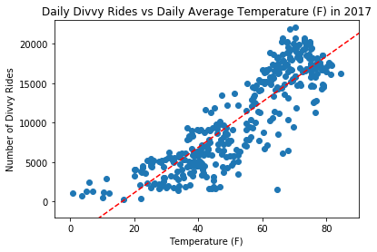

# Divvy_Weather
A look at the relationship between Divvy bike use and the weather in Chicago 2017.

This is a quick look at how divvy ridership changes with the weather. This project uses a jupyter notebook running python and using pandas, matplotlib and numpy. The weather data was collected from the OpenWeatherMap API using a query for Chicago in 2017. The Divvy Bike rider data was collected from the divvybikes.com website.

Data Sources:
[OpenWeatherMap](https://openweathermap.org/), 
[Divvy Data](https://www.divvybikes.com/system-data)

***

  

###### Divvy rides per day: the ridership of Divvy greatly increases during the summer, as expected. 
***

  

###### Number of rides vs Cloud Coverage: The cloudier it gets, the less people ride Divvy Bikes. 
***

  

###### Daily rides vs Average Temperature: You can see as it gets warmer, more Divvy rides are made as the trendline indicates. However, you can see up the upper temperature range, right around 80degrees, there is a slight dropoff of riders due to excessive heat. 
***

  

###### Number of Divvy Rides during weather conditions: At first glance this chart seems to indicate that just as many rides are made during "good" weather as "bad" weather. However, the weather labels of "smoke", "haze" and "clouds" are varrying degrees of less-than-clear weather and when combined, outweigh the "rain and "thunderstorm" categories. 
***
