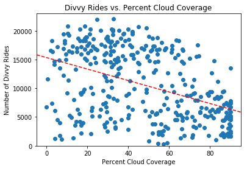
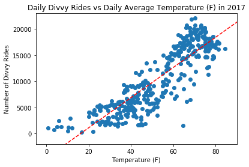
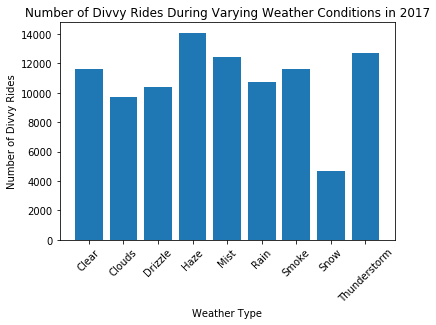

```python
# import dependencies

import pandas as pd
import matplotlib.pyplot as plt
import json
import numpy as np

```


```python
# load weather data

with open('chicago_weather.json') as data_file:    
    data = json.load(data_file)
data[4454]['weather']
```


    [{'description': 'haze', 'icon': '50d', 'id': 721, 'main': 'Haze'}]


```python
# grab relevant weather data to lists

cloud_coverage = []
temperature = []
weather_type = []
date = []

for datapoint in data:
    cloud_coverage.append(datapoint['clouds']['all'])
    temperature.append(datapoint['main']['temp'])
    weather_type.append(datapoint['weather'][0]['main'])
    date.append(datapoint['dt_iso'])

```


```python
# create weather dataframe

df = pd.DataFrame({
    "Cloud Coverage (%)": cloud_coverage,
    "Temperature (K)": temperature,
    "Weather": weather_type,
    "Date": date
                  })

df.head()
```


<div>
<style scoped>
    .dataframe tbody tr th:only-of-type {
        vertical-align: middle;
    }

    .dataframe tbody tr th {
        vertical-align: top;
    }

    .dataframe thead th {
        text-align: right;
    }
</style>
<table border="1" class="dataframe">
  <thead>
    <tr style="text-align: right;">
      <th></th>
      <th>Cloud Coverage (%)</th>
      <th>Date</th>
      <th>Temperature (K)</th>
      <th>Weather</th>
    </tr>
  </thead>
  <tbody>
    <tr>
      <th>0</th>
      <td>90</td>
      <td>2014-01-01 00:00:00 +0000 UTC</td>
      <td>261.98</td>
      <td>Rain</td>
    </tr>
    <tr>
      <th>1</th>
      <td>68</td>
      <td>2014-01-01 01:00:00 +0000 UTC</td>
      <td>262.11</td>
      <td>Rain</td>
    </tr>
    <tr>
      <th>2</th>
      <td>68</td>
      <td>2014-01-01 02:00:00 +0000 UTC</td>
      <td>262.30</td>
      <td>Rain</td>
    </tr>
    <tr>
      <th>3</th>
      <td>68</td>
      <td>2014-01-01 03:00:00 +0000 UTC</td>
      <td>262.43</td>
      <td>Rain</td>
    </tr>
    <tr>
      <th>4</th>
      <td>68</td>
      <td>2014-01-01 04:00:00 +0000 UTC</td>
      <td>262.15</td>
      <td>Snow</td>
    </tr>
  </tbody>
</table>
</div>


```python
# filter for only 2017

df_2017 = df.loc[df["Date"].str.startswith('2017')]
df_2017.head()
```


<div>
<style scoped>
    .dataframe tbody tr th:only-of-type {
        vertical-align: middle;
    }

    .dataframe tbody tr th {
        vertical-align: top;
    }

    .dataframe thead th {
        text-align: right;
    }
</style>
<table border="1" class="dataframe">
  <thead>
    <tr style="text-align: right;">
      <th></th>
      <th>Cloud Coverage (%)</th>
      <th>Date</th>
      <th>Temperature (K)</th>
      <th>Weather</th>
    </tr>
  </thead>
  <tbody>
    <tr>
      <th>16018</th>
      <td>90</td>
      <td>2017-01-01 00:00:00 +0000 UTC</td>
      <td>274.06</td>
      <td>Clouds</td>
    </tr>
    <tr>
      <th>16019</th>
      <td>40</td>
      <td>2017-01-01 01:00:00 +0000 UTC</td>
      <td>272.94</td>
      <td>Clouds</td>
    </tr>
    <tr>
      <th>16020</th>
      <td>1</td>
      <td>2017-01-01 02:00:00 +0000 UTC</td>
      <td>272.14</td>
      <td>Clear</td>
    </tr>
    <tr>
      <th>16021</th>
      <td>1</td>
      <td>2017-01-01 03:00:00 +0000 UTC</td>
      <td>270.97</td>
      <td>Clear</td>
    </tr>
    <tr>
      <th>16022</th>
      <td>1</td>
      <td>2017-01-01 04:00:00 +0000 UTC</td>
      <td>270.14</td>
      <td>Clear</td>
    </tr>
  </tbody>
</table>
</div>


```python
# remove timestamps, get daily averages of temperature and cloud coverage, find the most common weather "type" of the day,
# convert Kelvin to Fahrenheit

df_2017['Date'] = df_2017['Date'].str.split(' ').str[0]
df_days = df_2017.groupby("Date").mean()
df_days["Weather"] = df_2017.groupby("Date").max()["Weather"]
df_days["Average Temperature (F)"] = 9/5 * (df_days["Temperature (K)"] - 273) + 32
df_days = df_days.reset_index()

df_days = df_days.drop(columns=["Temperature (K)"])
df_days.drop(df_days.tail(1).index,inplace=True)


df_days.head()
```


<div>
<style scoped>
    .dataframe tbody tr th:only-of-type {
        vertical-align: middle;
    }

    .dataframe tbody tr th {
        vertical-align: top;
    }

    .dataframe thead th {
        text-align: right;
    }
</style>
<table border="1" class="dataframe">
  <thead>
    <tr style="text-align: right;">
      <th></th>
      <th>Date</th>
      <th>Cloud Coverage (%)</th>
      <th>Weather</th>
      <th>Average Temperature (F)</th>
    </tr>
  </thead>
  <tbody>
    <tr>
      <th>0</th>
      <td>2017-01-01</td>
      <td>6.500000</td>
      <td>Mist</td>
      <td>28.02200</td>
    </tr>
    <tr>
      <th>1</th>
      <td>2017-01-02</td>
      <td>54.916667</td>
      <td>Rain</td>
      <td>33.83975</td>
    </tr>
    <tr>
      <th>2</th>
      <td>2017-01-03</td>
      <td>90.000000</td>
      <td>Rain</td>
      <td>39.21050</td>
    </tr>
    <tr>
      <th>3</th>
      <td>2017-01-04</td>
      <td>28.458333</td>
      <td>Mist</td>
      <td>20.11850</td>
    </tr>
    <tr>
      <th>4</th>
      <td>2017-01-05</td>
      <td>66.166667</td>
      <td>Snow</td>
      <td>11.18675</td>
    </tr>
  </tbody>
</table>
</div>


```python
# read divvy data

div = pd.read_csv("divvy_data_2017.csv")

div.head()
```


<div>
<style scoped>
    .dataframe tbody tr th:only-of-type {
        vertical-align: middle;
    }

    .dataframe tbody tr th {
        vertical-align: top;
    }

    .dataframe thead th {
        text-align: right;
    }
</style>
<table border="1" class="dataframe">
  <thead>
    <tr style="text-align: right;">
      <th></th>
      <th>Unnamed: 0</th>
      <th>trip_id</th>
      <th>start_time</th>
      <th>end_time</th>
      <th>bikeid</th>
      <th>tripduration</th>
      <th>from_station_id</th>
      <th>from_station_name</th>
      <th>to_station_id</th>
      <th>to_station_name</th>
      <th>usertype</th>
      <th>gender</th>
      <th>birthyear</th>
      <th>hour</th>
    </tr>
  </thead>
  <tbody>
    <tr>
      <th>0</th>
      <td>0</td>
      <td>13518905</td>
      <td>2017-03-31 23:59:07</td>
      <td>2017-04-01 00:13:24</td>
      <td>5292</td>
      <td>857</td>
      <td>66</td>
      <td>Clinton St &amp; Lake St</td>
      <td>171</td>
      <td>May St &amp; Cullerton St</td>
      <td>Subscriber</td>
      <td>Male</td>
      <td>1989.0</td>
      <td>23</td>
    </tr>
    <tr>
      <th>1</th>
      <td>1</td>
      <td>13518904</td>
      <td>2017-03-31 23:56:25</td>
      <td>2017-04-01 00:00:21</td>
      <td>4408</td>
      <td>236</td>
      <td>199</td>
      <td>Wabash Ave &amp; Grand Ave</td>
      <td>26</td>
      <td>McClurg Ct &amp; Illinois St</td>
      <td>Subscriber</td>
      <td>Male</td>
      <td>1990.0</td>
      <td>23</td>
    </tr>
    <tr>
      <th>2</th>
      <td>2</td>
      <td>13518903</td>
      <td>2017-03-31 23:55:33</td>
      <td>2017-04-01 00:01:21</td>
      <td>696</td>
      <td>348</td>
      <td>520</td>
      <td>Greenview Ave &amp; Jarvis Ave</td>
      <td>432</td>
      <td>Clark St &amp; Lunt Ave</td>
      <td>Subscriber</td>
      <td>Female</td>
      <td>1979.0</td>
      <td>23</td>
    </tr>
    <tr>
      <th>3</th>
      <td>3</td>
      <td>13518902</td>
      <td>2017-03-31 23:54:46</td>
      <td>2017-03-31 23:59:34</td>
      <td>4915</td>
      <td>288</td>
      <td>110</td>
      <td>Dearborn St &amp; Erie St</td>
      <td>142</td>
      <td>McClurg Ct &amp; Erie St</td>
      <td>Subscriber</td>
      <td>Male</td>
      <td>1985.0</td>
      <td>23</td>
    </tr>
    <tr>
      <th>4</th>
      <td>4</td>
      <td>13518901</td>
      <td>2017-03-31 23:53:33</td>
      <td>2017-04-01 00:00:28</td>
      <td>4247</td>
      <td>415</td>
      <td>327</td>
      <td>Sheffield Ave &amp; Webster Ave</td>
      <td>331</td>
      <td>Halsted St &amp; Blackhawk St (*)</td>
      <td>Subscriber</td>
      <td>Female</td>
      <td>1989.0</td>
      <td>23</td>
    </tr>
  </tbody>
</table>
</div>


```python
# pull relevant divvy data to dataframe

div_df = pd.DataFrame({"Date": div["start_time"],
                      "Count": div.index.values})
div_df.head()

```


<div>
<style scoped>
    .dataframe tbody tr th:only-of-type {
        vertical-align: middle;
    }

    .dataframe tbody tr th {
        vertical-align: top;
    }

    .dataframe thead th {
        text-align: right;
    }
</style>
<table border="1" class="dataframe">
  <thead>
    <tr style="text-align: right;">
      <th></th>
      <th>Count</th>
      <th>Date</th>
    </tr>
  </thead>
  <tbody>
    <tr>
      <th>0</th>
      <td>0</td>
      <td>2017-03-31 23:59:07</td>
    </tr>
    <tr>
      <th>1</th>
      <td>1</td>
      <td>2017-03-31 23:56:25</td>
    </tr>
    <tr>
      <th>2</th>
      <td>2</td>
      <td>2017-03-31 23:55:33</td>
    </tr>
    <tr>
      <th>3</th>
      <td>3</td>
      <td>2017-03-31 23:54:46</td>
    </tr>
    <tr>
      <th>4</th>
      <td>4</td>
      <td>2017-03-31 23:53:33</td>
    </tr>
  </tbody>
</table>
</div>


```python
# remove timestamp

div_df['Date'] = div_df['Date'].str.split(' ').str[0]
```


```python
# groupy by date to get count of divvy rides

div_df = div_df.groupby("Date").count()
div_df.head()
```


<div>
<style scoped>
    .dataframe tbody tr th:only-of-type {
        vertical-align: middle;
    }

    .dataframe tbody tr th {
        vertical-align: top;
    }

    .dataframe thead th {
        text-align: right;
    }
</style>
<table border="1" class="dataframe">
  <thead>
    <tr style="text-align: right;">
      <th></th>
      <th>Count</th>
    </tr>
    <tr>
      <th>Date</th>
      <th></th>
    </tr>
  </thead>
  <tbody>
    <tr>
      <th>2017-01-01</th>
      <td>1727</td>
    </tr>
    <tr>
      <th>2017-01-02</th>
      <td>1960</td>
    </tr>
    <tr>
      <th>2017-01-03</th>
      <td>4537</td>
    </tr>
    <tr>
      <th>2017-01-04</th>
      <td>3269</td>
    </tr>
    <tr>
      <th>2017-01-05</th>
      <td>2917</td>
    </tr>
  </tbody>
</table>
</div>


```python
# reset index to prep dataframe merges

div_df = div_df.reset_index()
div_df.head()
```


<div>
<style scoped>
    .dataframe tbody tr th:only-of-type {
        vertical-align: middle;
    }

    .dataframe tbody tr th {
        vertical-align: top;
    }

    .dataframe thead th {
        text-align: right;
    }
</style>
<table border="1" class="dataframe">
  <thead>
    <tr style="text-align: right;">
      <th></th>
      <th>Date</th>
      <th>Count</th>
    </tr>
  </thead>
  <tbody>
    <tr>
      <th>0</th>
      <td>2017-01-01</td>
      <td>1727</td>
    </tr>
    <tr>
      <th>1</th>
      <td>2017-01-02</td>
      <td>1960</td>
    </tr>
    <tr>
      <th>2</th>
      <td>2017-01-03</td>
      <td>4537</td>
    </tr>
    <tr>
      <th>3</th>
      <td>2017-01-04</td>
      <td>3269</td>
    </tr>
    <tr>
      <th>4</th>
      <td>2017-01-05</td>
      <td>2917</td>
    </tr>
  </tbody>
</table>
</div>


```python
# merge dataframes

df_final = df_days

df_final["# of Divvy Rides"] = div_df["Count"]
df_final.head()


```


<div>
<style scoped>
    .dataframe tbody tr th:only-of-type {
        vertical-align: middle;
    }

    .dataframe tbody tr th {
        vertical-align: top;
    }

    .dataframe thead th {
        text-align: right;
    }
</style>
<table border="1" class="dataframe">
  <thead>
    <tr style="text-align: right;">
      <th></th>
      <th>Date</th>
      <th>Cloud Coverage (%)</th>
      <th>Weather</th>
      <th>Average Temperature (F)</th>
      <th># of Divvy Rides</th>
    </tr>
  </thead>
  <tbody>
    <tr>
      <th>0</th>
      <td>2017-01-01</td>
      <td>6.500000</td>
      <td>Mist</td>
      <td>28.02200</td>
      <td>1727</td>
    </tr>
    <tr>
      <th>1</th>
      <td>2017-01-02</td>
      <td>54.916667</td>
      <td>Rain</td>
      <td>33.83975</td>
      <td>1960</td>
    </tr>
    <tr>
      <th>2</th>
      <td>2017-01-03</td>
      <td>90.000000</td>
      <td>Rain</td>
      <td>39.21050</td>
      <td>4537</td>
    </tr>
    <tr>
      <th>3</th>
      <td>2017-01-04</td>
      <td>28.458333</td>
      <td>Mist</td>
      <td>20.11850</td>
      <td>3269</td>
    </tr>
    <tr>
      <th>4</th>
      <td>2017-01-05</td>
      <td>66.166667</td>
      <td>Snow</td>
      <td>11.18675</td>
      <td>2917</td>
    </tr>
  </tbody>
</table>
</div>


```python
# divvy rides per day through 2017

plt.scatter(df_final["Date"], df_final["# of Divvy Rides"])

plt.title("Divvy Rides per Day 2017")
plt.xlabel("Date (Jan - Dec, 2017)")
plt.ylabel("Number of Divvy Rides")
plt.xticks([])
plt.show
```


    <function matplotlib.pyplot.show>


```python
# number of divvy rides based on the days average percent cloud coverage

plt.scatter(df_final["Cloud Coverage (%)"], df_final["# of Divvy Rides"])
plt.title("Divvy Rides vs. Percent Cloud Coverage")
plt.xlabel("Percent Cloud Coverage")
plt.ylabel("Number of Divvy Rides")

z = np.polyfit(df_final["Cloud Coverage (%)"], df_final["# of Divvy Rides"], 1)
p = np.poly1d(z)
plt.plot(z,p(z), "r--")

plt.xlim(-5, 95)
plt.ylim(-10, 23000)

plt.show
```


    <function matplotlib.pyplot.show>





```python
# number of divvy rides based on the days average Temperature

plt.scatter(df_final["Average Temperature (F)"], df_final["# of Divvy Rides"])
plt.title("Daily Divvy Rides vs Daily Average Temperature (F) in 2017")
plt.xlabel("Temperature (F)")
plt.ylabel("Number of Divvy Rides")

z = np.polyfit(df_final["Average Temperature (F)"], df_final["# of Divvy Rides"], 1)
p = np.poly1d(z)
plt.plot(z,p(z), "r--")

plt.xlim(-5, 90)
plt.ylim(-2000, 23000)
```


    (-2000, 23000)





```python
# format dataframe to show average number of divvy rides during different weather conditions

df_weather = df_final.groupby("Weather").mean()
df_weather = df_weather.dropna()

df_weather
```


<div>
<style scoped>
    .dataframe tbody tr th:only-of-type {
        vertical-align: middle;
    }

    .dataframe tbody tr th {
        vertical-align: top;
    }

    .dataframe thead th {
        text-align: right;
    }
</style>
<table border="1" class="dataframe">
  <thead>
    <tr style="text-align: right;">
      <th></th>
      <th>Cloud Coverage (%)</th>
      <th>Average Temperature (F)</th>
      <th># of Divvy Rides</th>
    </tr>
    <tr>
      <th>Weather</th>
      <th></th>
      <th></th>
      <th></th>
    </tr>
  </thead>
  <tbody>
    <tr>
      <th>Clear</th>
      <td>0.722222</td>
      <td>47.964747</td>
      <td>11642.333333</td>
    </tr>
    <tr>
      <th>Clouds</th>
      <td>31.707218</td>
      <td>46.634334</td>
      <td>9741.408451</td>
    </tr>
    <tr>
      <th>Drizzle</th>
      <td>52.051471</td>
      <td>55.205529</td>
      <td>10420.000000</td>
    </tr>
    <tr>
      <th>Haze</th>
      <td>27.420455</td>
      <td>61.001068</td>
      <td>14084.272727</td>
    </tr>
    <tr>
      <th>Mist</th>
      <td>33.930997</td>
      <td>55.968198</td>
      <td>12458.029851</td>
    </tr>
    <tr>
      <th>Rain</th>
      <td>61.119806</td>
      <td>55.319352</td>
      <td>10743.306818</td>
    </tr>
    <tr>
      <th>Smoke</th>
      <td>21.229167</td>
      <td>51.989000</td>
      <td>11594.000000</td>
    </tr>
    <tr>
      <th>Snow</th>
      <td>63.749957</td>
      <td>30.776783</td>
      <td>4703.640000</td>
    </tr>
    <tr>
      <th>Thunderstorm</th>
      <td>57.613660</td>
      <td>66.345842</td>
      <td>12679.428571</td>
    </tr>
  </tbody>
</table>
</div>


```python
# Average number of divvy rides based on the day's general weather

plt.bar(df_weather.index, df_weather["# of Divvy Rides"])
plt.xticks(rotation=45)
plt.title("Number of Divvy Rides During Varying Weather Conditions in 2017")
plt.xlabel("Weather Type")
plt.ylabel("Number of Divvy Rides")
```


    Text(0,0.5,'Number of Divvy Rides')




